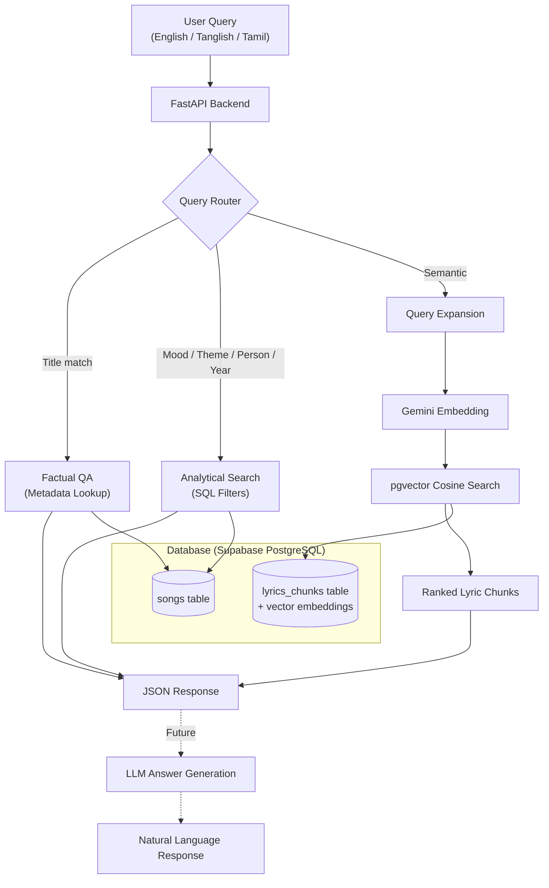

# 🎶 Tamil Song RAG Agent — Project Progress Report

**Date:** July 27, 2026
**Project Start:** July 4, 2026
**Total Commits:** 8

---

## 1. Project Overview

A **Retrieval-Augmented Generation (RAG)** application for searching and querying Tamil songs by title, lyrics meaning, singer, lyricist, composer, mood, theme, and more. The system supports queries in **English, Tanglish (Tamil written in English), and Tamil script**.

---

## 2. Tech Stack

| Layer | Technology | Status |
|---|---|---|
| Backend Framework | FastAPI (Python) | ✅ Implemented |
| Database | PostgreSQL + pgvector (hosted on Supabase) | ✅ Implemented |
| ORM | SQLAlchemy 2.0 | ✅ Implemented |
| Embeddings | Gemini Embedding 2 (`gemini-embedding-2`, 3072-dim) | ✅ Implemented |
| LLM (for answer generation) | Gemini (`gemini-2.5-flash` via `google-genai`) | ✅ Implemented |
| Query Expansion | Custom concept dictionary (Tamil/Tanglish/English synonyms) | ✅ Implemented |
| Experiment Tracking | MLflow | ✅ Implemented |
| Frontend | Next.js / React | ❌ Not started |
| Deployment | Vercel + Railway / Supabase | ❌ Not started |

---

## 3. Architecture



---

## 4. Data Model

### Songs Table
| Column | Type | Description |
|---|---|---|
| `id` | Integer (PK) | Auto-increment ID |
| `title` | String(255) | Song title |
| `movie` | String(255) | Movie name |
| `year` | Integer | Release year |
| `singers` | Text | Comma-separated singer names |
| `lyricist` | String(255) | Lyricist name |
| `composer` | String(255) | Music composer |
| `mood` | String(100) | Mood (Romantic, Sad, Energetic, etc.) |
| `themes` | Text | Semicolon-separated themes |
| `lyrics` | Text | Full lyrics text (Tanglish) |
| `source_url` | Text | Source URL |

### Lyrics Chunks Table
| Column | Type | Description |
|---|---|---|
| `id` | Integer (PK) | Auto-increment ID |
| `song_id` | Integer (FK → songs) | Parent song reference |
| `chunk_text` | Text | One lyric line |
| `chunk_index` | Integer | Position index in song |
| `start_line` / `end_line` | Integer | Line range |
| `embedding` | Vector(3072) | Gemini embedding vector |

---

## 5. Dataset

- **60 Tamil songs** in [sample_songs.csv](file:///f:/Projects/RAG_Tamil_Songs/backend/data/sample_songs.csv)
- Covers artists like **A. R. Rahman, Harris Jayaraj, Anirudh Ravichander, Yuvan Shankar Raja**
- Lyrics stored in **Tanglish** (Tamil written in English script)
- Moods: Romantic, Sad, Energetic, Happy, Melancholy, Emotional, Peaceful, Folk, Playful
- Years range: **1992 – 2024**
- Includes 2 synthetic demo songs for testing

---

## 6. Implementation Progress

### Phase 1: Project Setup *(July 4)* ✅
- [x] FastAPI project structure initialized
- [x] Virtual environment and dependencies configured
- [x] PostgreSQL + Supabase database connection
- [x] SQLAlchemy ORM with `declarative_base`
- [x] `.env` configuration for secrets
- [x] `.gitignore` set up

### Phase 2: Core CRUD & QA *(July 5)* ✅
- [x] `Song` SQLAlchemy model
- [x] CSV seeder script ([seed_songs.py](file:///f:/Projects/RAG_Tamil_Songs/backend/scripts/seed_songs.py))
- [x] **Songs API** — `GET /songs/`, `GET /songs/search`, `GET /songs/filter`, `GET /songs/{id}`
- [x] **Factual QA** — `POST /qa/ask` (who wrote, who composed, who sang, which movie)
- [x] **Analytical Search** — mood, theme, year, and person detection with SQL filtering
- [x] Keyword-based mood & theme dictionaries (English + Tamil + Tanglish)

### Phase 3: Lyrics Chunking & Keyword Search *(July 5)* ✅
- [x] `LyricsChunk` model with song relationship (cascade delete)
- [x] Line-level chunking script ([chunk_lyrics.py](file:///f:/Projects/RAG_Tamil_Songs/backend/scripts/chunk_lyrics.py))
- [x] `GET /lyrics/chunks` — browse lyric chunks
- [x] `GET /lyrics/search?q=` — keyword search inside lyrics
- [x] `GET /lyrics/theme/{theme}` — search lyrics by theme (eyes, rain, love, etc.)

### Phase 4: Semantic Search (Vector Embeddings) *(July 12)* ✅
- [x] Gemini Embedding Service ([embedding_service.py](file:///f:/Projects/RAG_Tamil_Songs/backend/app/services/embedding_service.py))
  - Model: `gemini-embedding-2` (3072 dimensions)
- [x] Embedding generation script ([generate_embeddings.py](file:///f:/Projects/RAG_Tamil_Songs/backend/scripts/generate_embeddings.py))
- [x] pgvector cosine distance search
- [x] `GET /lyrics/semantic-search?q=` endpoint
- [x] Vector embeddings stored in `lyrics_chunks.embedding` column

### Phase 5: Query Expansion *(July 12)* ✅
- [x] Concept dictionary with Tamil/Tanglish/English synonyms ([query_expansion.py](file:///f:/Projects/RAG_Tamil_Songs/backend/app/services/query_expansion.py))
- [x] Covers 5 concepts: **eyes, love, sadness, rain, mother**
- [x] Automatic synonym injection into search queries
- [x] External config file ([concept_dictionary.json](file:///f:/Projects/RAG_Tamil_Songs/backend/config/concept_dictionary.json))

### Phase 6: Retrieval Evaluation *(July 12)* ✅
- [x] **40-query evaluation dataset** ([evaluation_queries.csv](file:///f:/Projects/RAG_Tamil_Songs/backend/data/evaluation_queries.csv))
  - 5 query types: `metadata_factual`, `structured_filter`, `theme_search`, `semantic_lyrics`, `tanglish_query`, `tamil_query`, `negative`
  - Difficulty levels: easy, medium, hard
- [x] Evaluation script with IR metrics ([evaluate_retrieval.py](file:///f:/Projects/RAG_Tamil_Songs/backend/scripts/evaluate_retrieval.py))
  - Hit@5, Precision@5, MRR (Mean Reciprocal Rank)
- [x] MLflow experiment tracking ([evaluate_retrieval_mlflow.py](file:///f:/Projects/RAG_Tamil_Songs/backend/scripts/evaluate_retrieval_mlflow.py))
  - Logs params, metrics, and artifacts per run
  - A/B comparison: baseline vs. query expansion

---

## 7. API Endpoints

| Method | Endpoint | Description | Status |
|---|---|---|---|
| `GET` | `/` | Health check | ✅ |
| `GET` | `/songs/` | List all songs | ✅ |
| `GET` | `/songs/search?q=` | Full-text search across all fields | ✅ |
| `GET` | `/songs/filter` | Filter by mood, year, lyricist, composer, singer, theme | ✅ |
| `GET` | `/songs/{id}` | Get song by ID | ✅ |
| `POST` | `/qa/ask` | Natural language question answering | ✅ |
| `GET` | `/lyrics/chunks` | Browse lyric chunks (limit 50) | ✅ |
| `GET` | `/lyrics/search?q=` | Keyword search in lyrics | ✅ |
| `GET` | `/lyrics/theme/{theme}` | Search lyrics by theme | ✅ |
| `GET` | `/lyrics/semantic-search?q=` | Vector similarity search | ✅ |
| `POST` | `/chat/` | RAG-powered chat | ⏳ Stub only |

---

## 8. Retrieval Evaluation Results

### Baseline (Semantic Search Only)

| Metric | Value |
|---|---|
| Evaluated Queries | 36 |
| **Hit@5** | **0.583** |
| **Precision@5** | **0.167** |
| **MRR** | **0.456** |

### With Query Expansion

| Metric | Value |
|---|---|
| Evaluated Queries | 36 |
| **Hit@5** | **0.528** |
| **Precision@5** | **0.125** |
| **MRR** | **0.398** |

> [!WARNING]
> **Query expansion currently *hurts* performance.** The synonym injection dilutes the embedding signal — adding too many unrelated terms pushes the query vector away from the target. This is a known issue that needs to be addressed by switching to a smarter expansion strategy (e.g., LLM-based query rewriting or weighted term injection).

### Performance by Query Type (Baseline)

| Query Type | Queries | Hit@5 | Notes |
|---|---|---|---|
| `metadata_factual` | 5 | **1.000** | ✅ Perfect — title-in-query matching works well |
| `structured_filter` | 12 | **0.833** | ⚠️ Relies on semantic search instead of SQL filters |
| `theme_search` | 5 | **0.200** | ❌ Poor — theme matching via embeddings is weak |
| `semantic_lyrics` | 7 | **0.429** | ⚠️ Mixed — works for direct Tanglish matches |
| `tanglish_query` | 5 | **0.400** | ⚠️ Cross-script gap is a challenge |
| `tamil_query` | 3 | **0.000** | ❌ Complete failure — Tamil script ↔ Tanglish gap |

---

## 9. Project File Structure

```
RAG_Tamil_Songs/
├── README.md
├── mvp.md                    # MVP feature list
├── techstack.md              # Tech stack document
├── Picture1.png              # Evaluation metrics chart
├── .gitignore
│
└── backend/
    ├── .env                  # Supabase DB URL + Gemini API key
    ├── requirements.txt      # Python dependencies (283 packages)
    ├── test.py               # Quick Gemini embedding test
    │
    ├── app/
    │   ├── __init__.py
    │   ├── main.py           # FastAPI entry point + router registration
    │   ├── database.py       # SQLAlchemy engine + session factory
    │   ├── models.py         # Song + LyricsChunk models (pgvector)
    │   │
    │   ├── routes/
    │   │   ├── songs.py      # CRUD + search + filter endpoints
    │   │   ├── qa.py         # Natural language QA (rule-based)
    │   │   ├── lyrics.py     # Lyrics search + semantic search
    │   │   └── chat.py       # RAG chat endpoint (TODO stub)
    │   │
    │   ├── services/
    │   │   ├── embedding_service.py  # Gemini embedding generation
    │   │   ├── llm_service.py        # LLM answer gen (TODO stub)
    │   │   └── query_expansion.py    # Tamil/Tanglish synonym expansion
    │   │
    │   └── utils/
    │       └── __init__.py
    │
    ├── scripts/
    │   ├── seed_songs.py               # Seed DB from CSV
    │   ├── scrape_songs.py             # Web scraper (empty)
    │   ├── chunk_lyrics.py             # Split lyrics into chunks
    │   ├── generate_embeddings.py      # Generate vector embeddings
    │   ├── evaluate_retrieval.py       # Retrieval evaluation script
    │   └── evaluate_retrieval_mlflow.py # MLflow evaluation experiment
    │
    ├── config/
    │   └── concept_dictionary.json     # Query expansion synonyms
    │
    └── data/
        ├── sample_songs.csv            # 60 songs dataset
        ├── evaluation_queries.csv      # 40 evaluation queries
        ├── semantic_baseline_results.csv
        └── semantic_expanded_results.csv
```

---

## 10. Git Timeline

| Date | Commit | Summary |
|---|---|---|
| Jul 4 | `caa5e84` | Initialize backend project structure and dependencies |
| Jul 5 | `1462865` | FastAPI app + song QA route |
| Jul 5 | `91a5e95` | Filtered analytical song search |
| Jul 5 | `be8746d` | Lyrics chunking + keyword lyrics search |
| Jul 12 | `53e8a7d` | Database schema, lyrics routes, Gemini embeddings |
| Jul 12 | `aed7bb0` | Lyric embeddings + semantic search |
| Jul 12 | `b7b2a8d` | Evaluation dataset + retrieval performance script |
| Jul 12 | `658a234` | Query expansion service + MLflow evaluation |

---

## 11. What's Done vs. What's Left

### ✅ Completed (MVP Backend)

| Feature | Details |
|---|---|
| Song metadata CRUD | List, search, filter, get by ID |
| Rule-based QA | Factual questions about title, lyricist, composer, singer, movie |
| Analytical search | Filter by mood, theme, year, person (SQL-based) |
| Lyrics chunking | Line-level chunks with DB storage |
| Keyword lyrics search | SQL `ILIKE` pattern matching |
| Theme-based lyrics search | Multilingual keyword dictionaries |
| Vector embeddings | Gemini Embedding 2 (3072-dim) stored in pgvector |
| Semantic search | Cosine distance ranking on lyric chunks |
| Query expansion | Tamil/Tanglish/English synonym dictionary |
| Evaluation framework | 40-query dataset, Hit@5, Precision@5, MRR |
| Experiment tracking | MLflow for A/B comparisons |
| LLM answer generation | [llm_service.py](file:///f:/Projects/RAG_Tamil_Songs/backend/app/services/llm_service.py) with Gemini SDK (`gemini-2.5-flash`), grounding prompt, and error fallback |
| Hybrid query routing | [retrieval_service.py](file:///f:/Projects/RAG_Tamil_Songs/backend/app/services/retrieval_service.py) routing title/SQL filters to metadata and semantic queries to pgvector |
| RAG chat endpoint | [chat.py](file:///f:/Projects/RAG_Tamil_Songs/backend/app/routes/chat.py) chaining retrieval and LLM generation with latency tracking and sources |
| RAG unit tests | [test_chat.py](file:///f:/Projects/RAG_Tamil_Songs/backend/tests/test_chat.py) with offline SQLite in-memory test harness |

### ❌ Not Yet Implemented

| Feature | Priority | Notes |
|---|---|---|
| **Web Scraper** | 🟡 Medium | [scrape_songs.py](file:///f:/Projects/RAG_Tamil_Songs/backend/scripts/scrape_songs.py) is empty. For scaling beyond 60 songs. |
| **Better Chunking** | 🟡 Medium | Current strategy is 1 line = 1 chunk. Grouping 2-4 lines (stanzas) would improve semantic coherence. |
| **Frontend** | 🟡 Medium | No frontend exists yet. Planned: Next.js / React. |
| **Query Expansion Fix** | 🟡 Medium | Current expansion hurts retrieval. Consider LLM-based rewriting or weighted terms. |
| **Tamil Script Support** | 🟡 Medium | Pure Tamil queries completely fail (0% Hit@5). Need transliteration or cross-lingual embeddings. |
| **Re-ranker** | 🟢 Low | Add a cross-encoder re-ranker on top of retrieved chunks for better precision. |
| **Deployment** | 🟢 Low | No CI/CD or deployment pipeline yet. |

---

## 12. Known Issues

| Issue | Severity | Details |
|---|---|---|
| DB connection fails without internet | 🔴 | Supabase-hosted PostgreSQL requires network access. The app crashes on startup if the DB is unreachable. |
| Query expansion degrades results | 🟡 | Adding all synonyms at once dilutes embeddings. Baseline outperforms expanded on most metrics. |
| Tamil script queries return 0 results | 🟡 | Lyrics are in Tanglish but queries in Tamil script — no transliteration bridge exists. |
| Theme search misses many relevant songs | 🟡 | Embeddings don't capture theme-level semantics well for single-line chunks. |
| `requirements.txt` is bloated | 🟢 | Contains 283 packages from global pip freeze, including unrelated packages (torch, whisper, kedro, etc.). |
| `scrape_songs.py` is empty | 🟢 | Placeholder file with no implementation. |

---

## 13. Recommended Next Steps

### Completed Steps (Phases 2, 3, & 5)
1. **✅ Wire up LLM answer generation** — Implemented [llm_service.py](file:///f:/Projects/RAG_Tamil_Songs/backend/app/services/llm_service.py) using `google-genai`.
2. **✅ Complete the RAG chat pipeline** — Built [chat.py](file:///f:/Projects/RAG_Tamil_Songs/backend/app/routes/chat.py) and [retrieval_service.py](file:///f:/Projects/RAG_Tamil_Songs/backend/app/services/retrieval_service.py).
3. **✅ Fix the requirements.txt** — Created a minimal, direct dependency file.
4. **✅ Improve chunking strategy** — Grouped lyrics into up to 4-line stanzas for better context matching.
5. **✅ Add Tamil transliteration & Query Expansion** — Replaced naive injection with dynamic LLM query rewriting (Tamil -> Tanglish & synonym expansion) in [query_expansion.py](file:///f:/Projects/RAG_Tamil_Songs/backend/app/services/query_expansion.py).

### Immediate Next Steps (Phase 6)
1. **Build the frontend** — Next.js chat interface with search/filter UI to interact with the FastAPI backend.

### Medium-term
2. **Scale the dataset** — Implement the web scraper to grow beyond 60 songs.
3. **Deploy** — Set up CI/CD with Vercel (frontend) + Railway/Render (backend).
